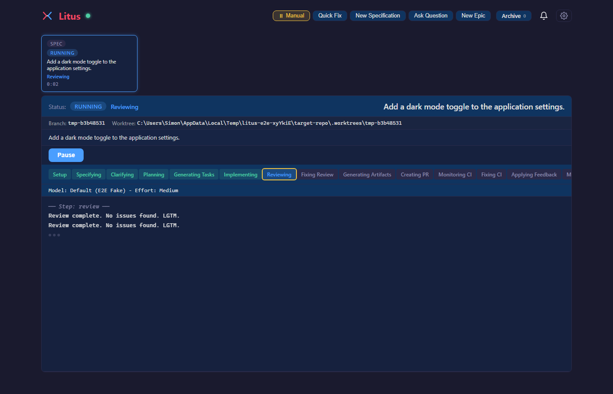
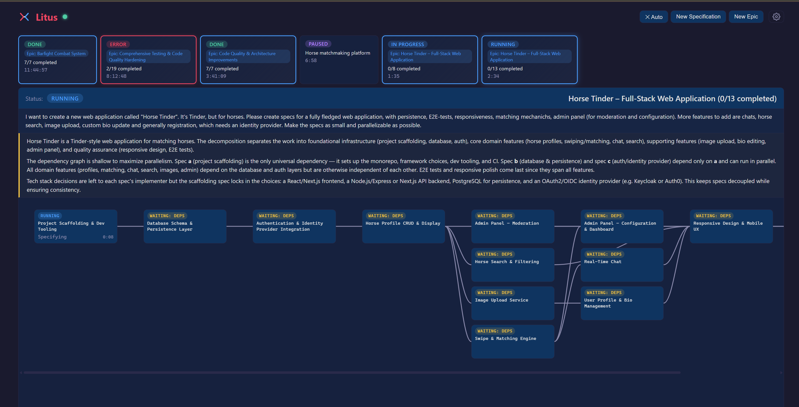
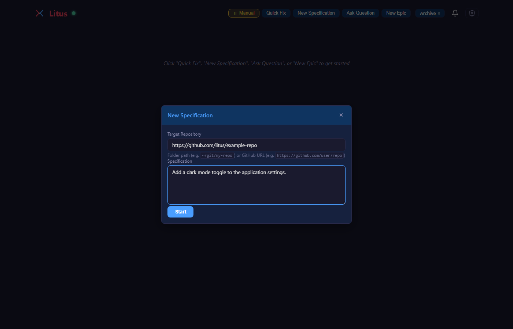
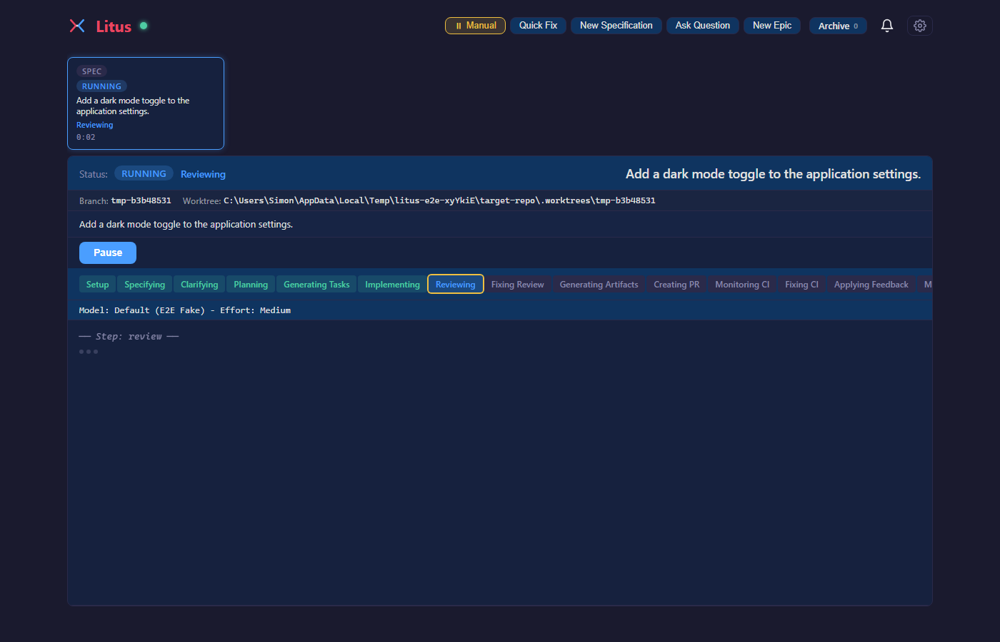
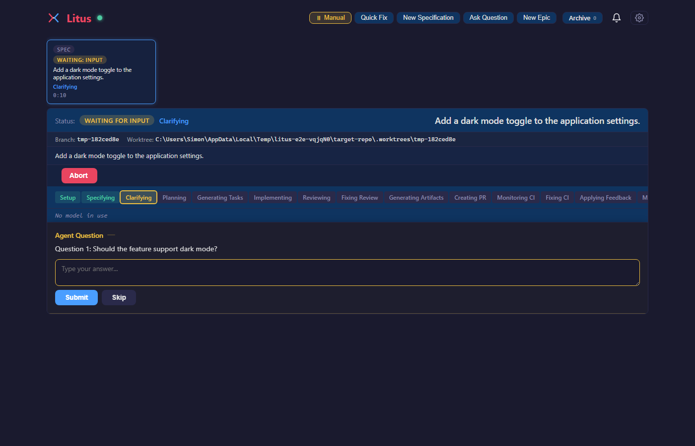

<p align="center">
  
</p>

<h1 align="center">Litus</h1>

<p align="center">
  <strong>A web-based orchestrator for Claude Code agents.</strong><br>
  Welcome to <em>vibe code hell</em>.
</p>

<p align="center">
  <a href="https://github.com/s-gehring/litus/actions"></a>
  
  
  
</p>

<p align="center">
  
</p>

---

Submit a feature spec, watch a Claude Code agent work through it step-by-step in your browser, answer its questions when
it gets stuck, and end up with a merged PR. Litus handles the entire lifecycle — from specification to CI green to
merge — so you can focus on the parts that actually need a human brain.

## Features

- **Fully automated pipeline** — Describe a feature, hit start. Litus takes it from spec to merged PR without manual
  intervention — specification, planning, implementation, code review, PR creation, CI monitoring, and merge all happen
  automatically.
- **Epic decomposition** — Got a feature too big for a single pass? Submit it as an epic. Litus breaks it into
  individual specs with dependency tracking and runs them in the right order, parallelizing where possible.
- **Human-in-the-loop when needed** — When the agent hits ambiguity, Litus detects the question and surfaces it in the
  UI. You answer, it resumes. Everything else runs hands-off.
- **CI-aware** — Litus monitors GitHub Actions after PR creation. If CI fails, the agent reads the failure logs and
  fixes the issue — no copy-pasting error output into a chat window.
- **Git worktree isolation** — Every workflow runs in its own worktree. Your main branch stays clean, and multiple
  workflows can run in parallel without conflicts.
- **Observable and configurable** — Real-time agent output streaming, periodic progress summaries, and per-step
  configuration for models, effort levels, prompts, and retry limits.
- **Max plan justifier** — Finally a reason to upgrade to the Claude Max plan. Your unlimited-feeling usage won't feel
  so unlimited after a few epics.

## Prerequisites

| Tool                                                                                                                | Why                                                                                                     |
|---------------------------------------------------------------------------------------------------------------------|---------------------------------------------------------------------------------------------------------|
| [Bun](https://bun.sh) >= 1.3.11                                                                                     | Runtime. Fast, TypeScript-native, no transpilation ceremony.                                            |
| [Claude Code](https://docs.anthropic.com/en/docs/claude-code)                                                       | The CLI agent that does the actual work. Must be installed and authenticated.                           |
| [GitHub CLI (`gh`)](https://cli.github.com/)                                                                        | PR creation, CI monitoring, merge operations. Must be authenticated with permission to merge PRs without reviews. |
| [Speckit](https://github.com/github/spec-kit) ([MIT License](https://github.com/github/spec-kit/blob/main/LICENSE)) | Claude Code slash commands for the specify → implement pipeline. Must be installed in your target repo. |

### Prepare Target Repository

Litus runs Claude Code agents against a **target repository** — the repo where you want code changes to happen. Before
starting your first workflow, make sure the target repo is set up:

1. **Initialize speckit** — Litus relies on [speckit](https://github.com/github/spec-kit) skills being present in the
   target repo. Install speckit into your target repository's `.claude/skills/` directory by following
   [speckit's setup instructions](https://github.com/github/spec-kit#getting-started).
2. **Authenticate `gh`** — Run `gh auth login` and make sure the CLI has access to the target repo. Litus uses `gh` for
   PR creation, CI polling, and merge.
3. **Authenticate Claude Code** — Run `claude` once in the target repo to ensure the CLI is authenticated and working.
4. **Verify git access** — Litus creates worktrees inside the target repo. Make sure you have push access and the repo
   is cloned (not a shallow clone).

## How to Use

> [!CAUTION]
> Litus runs Claude Code with `--dangerously-skip-permissions`, meaning the agent can read, write, and delete files
> without asking. It also creates PRs and merges them to your main branch automatically. This can introduce bugs into
> production systems or cause data loss. **Only run Litus in sandboxed environments or against repositories where you
> are comfortable with autonomous, unsupervised changes.**

### Install and run

```bash
# Clone
git clone https://github.com/s-gehring/litus.git
cd litus

# Install dependencies
bun install

# Build client + start server with hot reload
bun run dev
```

Open [http://localhost:3000](http://localhost:3000). Override with the `PORT` env var.

For production (client must be pre-built):

```bash
bun run start
```

### Docker

A pre-built image is published to [GitHub Container Registry](https://github.com/s-gehring/litus/pkgs/container/litus) on every release.

```bash
docker run -d \
  -p 3000:3000 \
  -e ANTHROPIC_API_KEY \
  -e GH_TOKEN \
  -v litus-data:/home/litus/.litus \
  -v /path/to/your/repo:/home/litus/repos/my-project \
  ghcr.io/s-gehring/litus:latest
```

#### Mounting target repositories

Litus runs Claude Code agents against a **target repository** — the repo where code changes happen. You must bind-mount
each target repo into the container so the agent can access it:

```bash
-v /path/to/your/repo:/home/litus/repos/my-project
```

The container path you choose (e.g. `/home/litus/repos/my-project`) is what you'll select in the Litus UI when starting
a workflow. You can mount multiple repositories:

```bash
-v ~/projects/frontend:/home/litus/repos/frontend \
-v ~/projects/backend:/home/litus/repos/backend
```
#### Claude Code authentication

The container ships with [Claude Code CLI](https://docs.anthropic.com/en/docs/agents-and-tools/claude-code/overview) installed globally. It needs valid credentials to call the Anthropic API.

**Option A — API key (recommended for containers)**

Pass your key as an environment variable:

```bash
docker run -d \
  -e ANTHROPIC_API_KEY="sk-ant-..." \
  -e GH_TOKEN="ghp_..." \
  -p 3000:3000 \
  -v litus-data:/home/litus/.litus \
  -v /path/to/your/repo:/home/litus/repos/my-project \
  ghcr.io/s-gehring/litus:latest
```

**Option B — Mount an existing session**

If you have already authenticated with `claude` on the host, bind-mount the credentials directory:

```bash
docker run -d \
  -v ~/.claude:/home/litus/.claude \
  -v ~/.config/gh:/home/litus/.config/gh:ro \
  -p 3000:3000 \
  -v litus-data:/home/litus/.litus \
  -v /path/to/your/repo:/home/litus/repos/my-project \
  ghcr.io/s-gehring/litus:latest
```

#### Environment variables

| Variable | Default | Description |
|----------|---------|-------------|
| `ANTHROPIC_API_KEY` | — | API key for Claude Code CLI (required unless you mount `~/.claude`) |
| `GH_TOKEN` | — | GitHub personal access token for `gh` CLI (required unless you mount `~/.config/gh`). `GITHUB_TOKEN` is also accepted. |
| `PORT` | `3000` | HTTP server listen port (inside the container) |

#### Volumes

| Path | Purpose |
|------|---------|
| `/home/litus/.litus` | Workflow state, epic definitions, app config, and audit logs. Mount a named volume or bind mount to persist data across container restarts. |
| `/home/litus/repos/<name>` | Target repository bind mounts. Mount one or more repos so the agent has something to work on. |
| `/home/litus/.claude` | Optional. Bind-mount an existing Claude Code session directory instead of using `ANTHROPIC_API_KEY`. |
| `/home/litus/.config/gh` | Optional. Bind-mount an existing GitHub CLI config directory instead of using `GH_TOKEN`. |

The entrypoint automatically creates the required subdirectories (`workflows/`, `audit/`) and fixes ownership on bind mounts.

#### Example with bind mount

```bash
mkdir -p ./litus-data

docker run -d \
  -e ANTHROPIC_API_KEY \
  -e GH_TOKEN \
  -p 3000:3000 \
  -v ./litus-data:/home/litus/.litus \
  -v ~/projects/my-app:/home/litus/repos/my-app \
  ghcr.io/s-gehring/litus:latest
```

> [!NOTE]
> The container runs as a non-root user (`litus`, UID 1001). The entrypoint uses `gosu` to fix volume
> permissions before dropping privileges — no manual `chown` needed.

### Using Litus

1. You enter a feature spec in the browser and hit **Start**
2. Litus creates a git worktree and spawns `claude -p <spec> --output-format stream-json`
3. The agent works through the pipeline: specify → clarify → plan → implement → review → PR → CI → merge
4. When the agent asks a question, it's surfaced in the UI — you answer, the session resumes
5. When CI fails, the agent reads the logs and tries to fix it (up to your configured limit)
6. When everything's green, Litus squash-merges the PR and cleans up

## Screenshots

|                                                            |                                                           |
|------------------------------------------------------------|-----------------------------------------------------------|
|           |  |
| Epic decomposition with dependencies                       | Creating a new specification                              |
|  |     |
| Pipeline in progress with live output                      | Agent asking a question                                   |

## How It Works

Litus orchestrates a 13-step pipeline. Each step is either handled by Litus itself or delegated to a Claude Code agent.

### The Pipeline

| Step           | Actor          | What happens                                              |
|----------------|----------------|-----------------------------------------------------------|
| **Setup**      | Litus          | Validates repo, git, GitHub CLI, auth, speckit skills     |
| **Specify**    | Claude         | Formalizes your description into a structured spec        |
| **Clarify**    | Claude + Human | Resolves ambiguities in the spec                          |
| **Plan**       | Claude         | Creates a technical design                                |
| **Tasks**      | Claude         | Generates a task checklist                                |
| **Implement**  | Claude         | Writes the code                                           |
| **Review**     | Claude         | Self-critiques the implementation                         |
| **Fix Review** | Claude         | Addresses review findings (loops if critical/major)       |
| **Create PR**  | Claude         | Commits, pushes, opens a GitHub PR                        |
| **Monitor CI** | Litus          | Polls GitHub Actions with exponential backoff             |
| **Fix CI**     | Claude + Litus | Reads failure logs, attempts fixes (configurable retries) |
| **Merge PR**   | Litus          | Squash-merges the PR                                      |
| **Sync Repo**  | Litus          | Pulls changes and cleans up the worktree                  |

### Epics

For features too large for a single workflow, Litus supports **epics**:

1. Click **New Epic** and describe the feature at a high level
2. Litus decomposes it into individual specs with dependency tracking
3. Specs execute in dependency order and as parallel as possible — downstream workflows wait for their blockers to
   complete
4. The epic tree view shows the full dependency graph and per-spec status

## Configuration

Click the gear icon in the header to open the config panel. Everything is configurable per-step:

- **Models** — Choose which Claude model to use for each pipeline step
- **Effort levels** — `low`, `medium`, `high`, or `max` per step
- **Prompts** — Customize question detection and review classification prompts
- **Limits** — Max review iterations, CI fix attempts, merge retries
- **Timing** — Poll intervals, idle timeouts, summary frequency
- **Auto Mode** — Skip optional checks and auto-answer questions (for the brave)

Config is persisted to `~/.litus/config.json`.

## Data Storage

All data lives under `~/.litus/`:

```
~/.litus/
  config.json                  # App configuration
  workflows/
    index.json                 # Workflow index
    {id}.json                  # Individual workflow state
    epics.json                 # Epic definitions
  audit/
    events.jsonl               # Audit log
```

## Tech Stack

| Layer    | Technology                                                                                                                     |
|----------|--------------------------------------------------------------------------------------------------------------------------------|
| Runtime  | [Bun](https://bun.sh)                                                                                                          |
| Server   | `Bun.serve()` — built-in HTTP + WebSocket, no framework                                                                        |
| Agent    | [Claude Code CLI](https://docs.anthropic.com/en/docs/claude-code) via `Bun.spawn` — no API key needed beyond what the CLI uses |
| Frontend | Vanilla TypeScript — no React, no Vue, no regrets                                                                              |
| Markdown | [marked](https://github.com/markedjs/marked) + [DOMPurify](https://github.com/cure53/DOMPurify)                                |
| Linting  | [Biome](https://biomejs.dev)                                                                                                   |
| Testing  | Bun test runner + [happy-dom](https://github.com/capricorn86/happy-dom)                                                         |
| CI       | GitHub Actions                                                                                                                 |

## Related Tools

Litus orchestrates a few external tools. Here's what they do and where to find them:

### [Claude Code](https://docs.anthropic.com/en/docs/claude-code)

Anthropic's CLI for Claude. This is the actual agent that reads your code, writes implementations, and creates PRs.
Litus spawns it as a child process and communicates via `--output-format stream-json`. **All AI interactions go through
the CLI** — Litus has zero direct API calls, so there's no extra API cost beyond your normal Claude Code usage. Think of
Litus as the control tower and Claude Code as the plane.

### [GitHub CLI (`gh`)](https://cli.github.com/)

GitHub's official CLI. Litus uses it for PR creation, CI status polling, failure log retrieval, and squash-merge
operations. You'll need it installed and authenticated (`gh auth login`).

### [Speckit](https://github.com/github/spec-kit)

A set of Claude Code [skills](https://docs.anthropic.com/en/docs/claude-code/skills) that power the
specify → implement pipeline. These live in your target repository's `.claude/skills/` directory and give the agent
structured prompts for each pipeline step. Without speckit, Litus doesn't know what to tell the agent to do.

## Development

### Running locally

```bash
bun run dev    # Build client + start server with --watch
```

### Quality checks

```bash
bun test                       # Run tests
bun run tsc --noEmit           # Type check
bunx biome ci .                # Lint & format (CI mode)
bunx biome check --write .     # Auto-fix lint & format
bun audit                      # Dependency vulnerability scan
```

### Contributing

1. Fork the repo
2. Create a feature branch (`feat/your-thing`)
3. Make your changes — keep commits atomic and small
4. Follow [Conventional Commits](https://www.conventionalcommits.org) for all commit messages (CI enforces this on PRs)
5. Run `bunx biome ci .` and `bun test` before pushing
6. Open a PR against `master`

Linting is enforced by Biome. CI will reject anything that doesn't pass `biome ci`, type checking, tests, or
conventional commit checks. Don't fight it.

## License

This project is licensed under the [GNU Affero General Public License v3.0](LICENSE.md).

This project utilizes AI products to generate code. The outputs of these tools are not covered by the AGPL license.
The authors of this software do not claim any ownership rights
over the code or other artifacts generated by the software.
